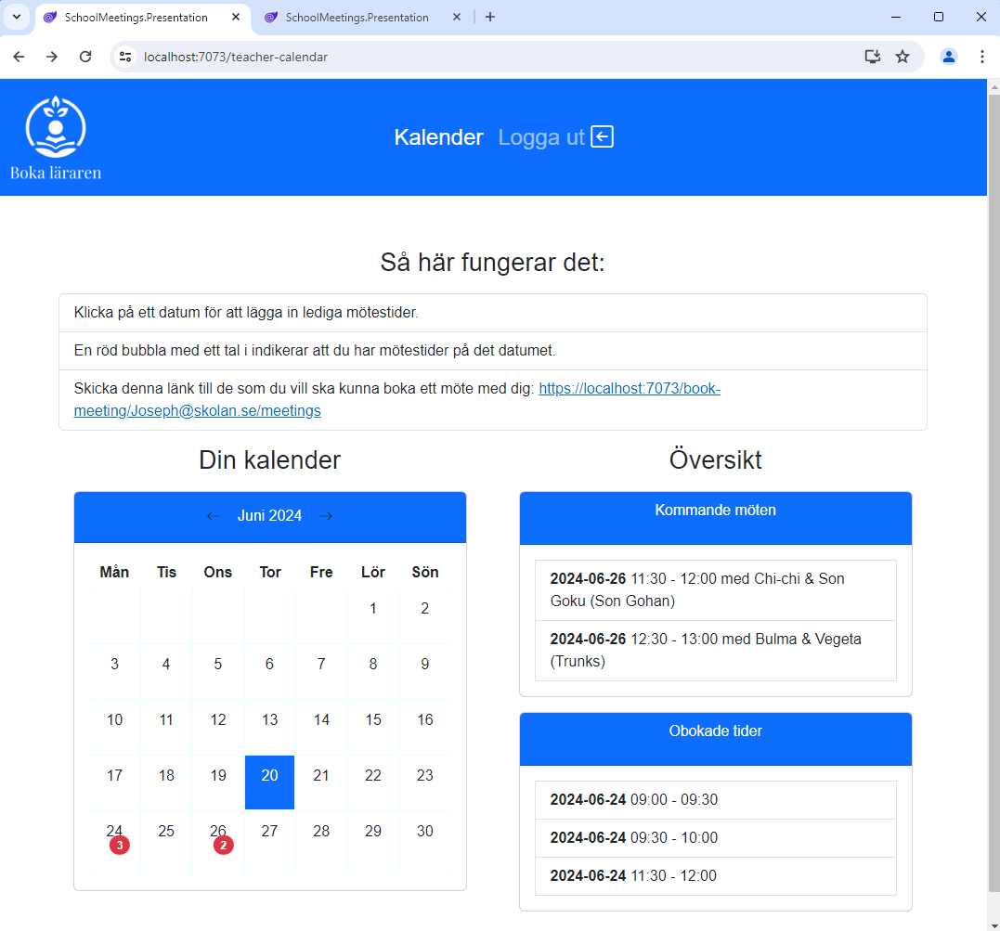
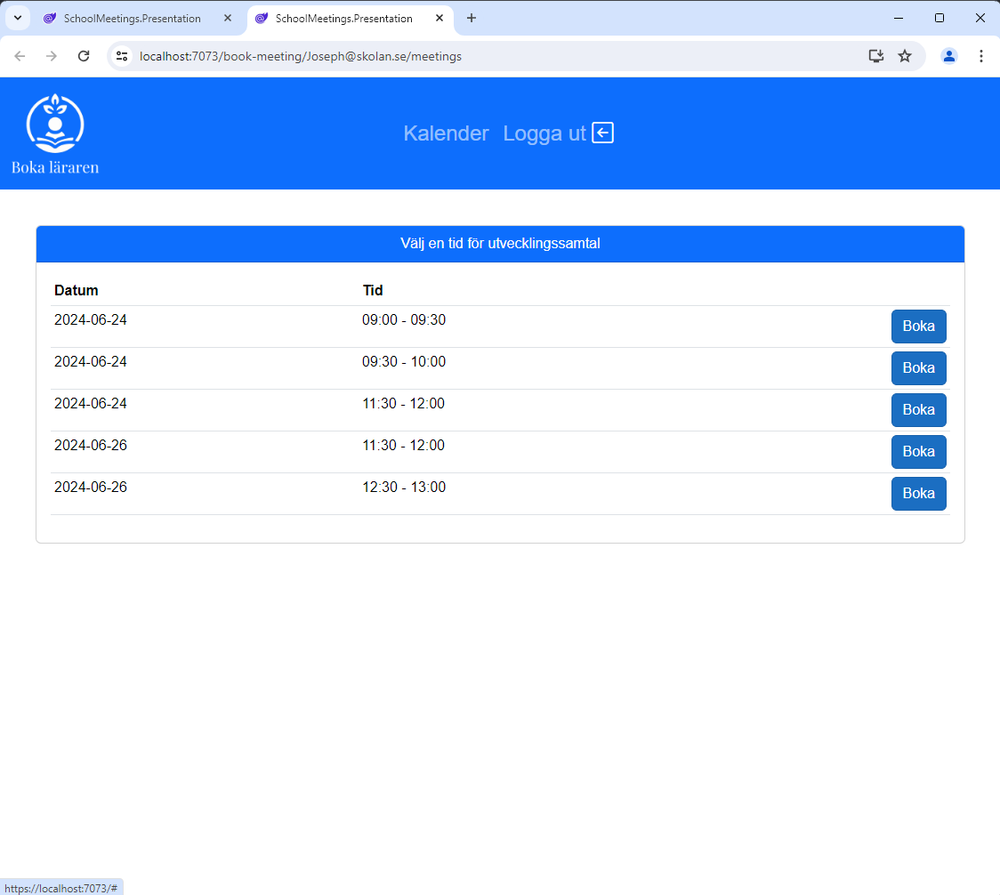

# SchoolMeetings
## Om projektet
I mitt förra yrkesliv var jag lärare i årskurserna 4-6. Bland mina otaliga arbetsuppgifter var utvecklingssamtal ett av dessa. Att kontakta vårdnadshavare för att boka utvecklingssamtalstider är något som kan ta mycket tid, men med ett bokningsverktyg till hands går det snabbt och smidigt både för lärare och vårdnadshavare. Denna webbapp syftar till fungera som ett bokningssystem som lärare kan använda för att lägga ut tillgängliga tider, som vårdnadshavare med en separat länk kan boka in sig på.
## Bilder

Inloggning och registrering

 
Översikt för lärare

 
Bokningssida för vårdnadshavare

## Tech-stack
<ul>
  <li>
    Blazor
  </li>
  <li>
    Asp.net core
  </li>
  <li>
    Minimal API
  </li>
  <li>
    Microsoft SQL-server
  </li>
  <li>
    MongoDb
  </li>
</ul>

## Kommande uppdateringar
<ul>
  <li>
    Elevkonton med sin individuella utvecklingsplan kopplad till sig
  </li>
  <li>
    Konton för vårdnadshavare som ger tillgång till sitt barns individuella utvecklingsplan
  </li>
  <li>
    Refaktorering av kod för att följa clean architecture
  </li>
  <li>
    Hosta sidan i Azure eller liknande molntjänst
  </li>
</ul>
